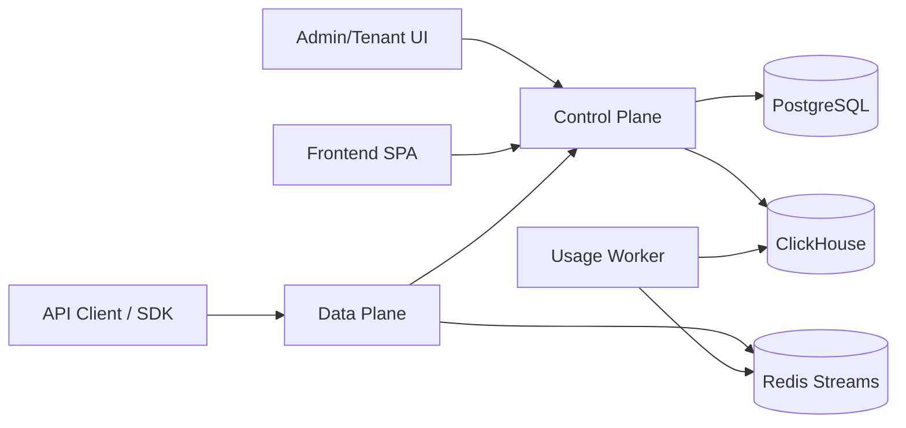

# Codex-Pool

<p align="center">
  
</p>

<p align="center">
  <strong>面向多租户与可观测场景的 Codex/OpenAI 兼容代理系统</strong><br/>
  Rust 双平面架构（Data Plane + Control Plane）+ React 管理台 + Docker 生产编排
</p>

<p align="center">
  
  
  
  
</p>

---

## 为什么是 Codex-Pool

Codex-Pool 用于把多个上游账号池化成一个统一入口，对外提供 **OpenAI/Codex 兼容接口**，并同时具备：

- 多租户隔离与 API Key 管理
- 账号路由、故障切换、快照热更新
- 请求日志事件流 + 用量聚合（Redis Stream + ClickHouse）
- 管理台（Admin Portal）与租户门户（Tenant Portal）
- 可生产部署的 Docker Compose 拆分

---

## 目录

- [架构总览](#架构总览)
- [5 分钟快速开始](#5-分钟快速开始)
- [生产部署](#生产部署)
- [Docker 常见问题](#docker-常见问题)
- [安全基线](#安全基线)
- [CI/CD](#cicd)
- [API 兼容面](#api-兼容面)
- [开发者指南（后置）](#开发者指南后置)
- [项目结构](#项目结构)

---

## 架构总览



### 组件职责

| 组件 | 职责 |
| --- | --- |
| `data-plane` | 兼容 `/v1/responses`、`/v1/chat/completions` 等接口；路由到上游账号；请求级 failover；可选内部调试路由 |
| `control-plane` | 管理 API、租户与 API Key、上游账号管理、策略管理、快照发布、报表查询 |
| `usage-worker` | 消费 Redis Stream 请求日志，按小时聚合写入 ClickHouse |
| `frontend` | Admin + Tenant 双门户，统一通过 `/api/v1` 访问 control-plane |

补充约定：

- `x-request-id` 用于请求链路追踪与日志关联，不作为计费幂等键。
- data-plane 会为每个可计费 logical request 生成内部 billing key；control-plane 只对该内部键做授权/捕获/释放幂等。
- `previous_response_id`、`session_id`、`x-codex-turn-state` 只参与 continuation / sticky routing，不直接承担账务幂等语义。

---

## 5 分钟快速开始

### 1) 启动开发环境

```bash
docker compose -f docker-compose.dev.yml up -d --build
```

### 2) 检查服务健康

```bash
curl -fsS http://127.0.0.1:8090/health
curl -fsS http://127.0.0.1:8091/health
```

### 3) 打开前端

- 管理台：`http://127.0.0.1:5173`
- 默认管理员（仅开发）：`admin / admin123456`

### 4) 运行一键冒烟（可选）

```bash
./scripts/smoke_dashboard_logs_billing.sh
```

---

## 生产部署

### 先准备生产变量

```bash
cp docker/.env.production.example docker/.env.production
```

必须替换的关键变量：

- `POSTGRES_PASSWORD`
- `CONTROL_PLANE_INTERNAL_AUTH_TOKEN`
- `CONTROL_PLANE_API_KEY_HMAC_KEYS`
- `CREDENTIALS_ENCRYPTION_KEY`
- `ADMIN_PASSWORD`
- `ADMIN_JWT_SECRET`

> 建议用 `openssl rand -base64 32` 生成高强度密钥。

### 方案 A：单机构建并部署（不依赖镜像仓库）

```bash
docker compose \
  --env-file docker/.env.production \
  -f docker-compose.yml \
  -f docker-compose.build.yml \
  up -d --build
```

这个方案**不需要**先把镜像上传到 Docker Hub/GHCR。

### 方案 B：多机/集群部署（镜像先推仓库）

1. 在 CI 通过 tag 自动发布镜像（已提供 `docker-publish.yml`，默认发布到 GHCR）。
2. 在部署机设置镜像地址：
   - `CONTROL_PLANE_IMAGE`
   - `DATA_PLANE_IMAGE`
   - `USAGE_WORKER_IMAGE`
   - `FRONTEND_IMAGE`
3. 启动：

```bash
docker compose --env-file docker/.env.production -f docker-compose.yml up -d
```

### 方案 C：`team` 版最小 Docker 部署（`app + postgres`）

`team` 版现在支持单容器承载 admin UI、tenant UI、control-plane API 与 `/v1/*` 代理，只需要再配一个 PostgreSQL。

1. 复制示例环境变量：

```bash
cp docker/.env.team.example docker/.env.team
```

2. 启动：

```bash
docker compose --env-file docker/.env.team -f docker-compose.team.yml up -d --build
```

3. 访问：

- 管理端与租户端统一入口：`http://127.0.0.1:${TEAM_APP_PORT:-8090}`
- 运行模式：`CODEX_POOL_EDITION=team`
- 默认不启动 Redis、ClickHouse、独立 frontend 容器

---

## Docker 常见问题

### 我必须上传 Docker Hub 吗？

不是必须。

- 单机部署：用 `docker-compose.build.yml` 本机构建，直接起服务。
- 多机部署：需要把镜像推到“某个可访问仓库”，可以是 Docker Hub、GHCR、私有 Harbor/ECR/GCR。

### 生产编排现在有什么修复？

当前仓库已补齐以下关键点：

- `docker-compose.yml` 为 `control-plane/data-plane/usage-worker` 显式设置 `command`
- control-plane 补齐关键必填环境变量（API Key HMAC key ring、凭据加密密钥等）
- 新增 `docker/frontend.runtime.Dockerfile`（构建静态资源 + Nginx）
- 新增 `docker/nginx.frontend.conf`，前端容器内反向代理 `/api` 到 control-plane
- 新增 `docker-compose.build.yml`，支持“本机构建生产镜像”

---

## 安全基线

### 已落实的仓库安全策略

- `config.toml` 已加入 `.gitignore`，防止本地配置误提交
- `.env.*`（除明确示例文件）默认忽略
- CI 集成 `gitleaks` 做 secrets 扫描

### 发布前强烈建议

1. 轮换所有历史暴露过的 token/refresh token/JWT secret。
2. 在首次公开仓库前，执行一次完整 secret 扫描（含 git history）。
3. 生产环境关闭 `ENABLE_INTERNAL_DEBUG_ROUTES`。
4. 将配置统一放到 `docker/.env.production` 或密钥管理系统，不在仓库存明文。

---

## CI/CD

### 已新增工作流

- `CI`（`.github/workflows/ci.yml`）
  - `gitleaks` secrets 扫描
  - Rust `check`：`cargo check --workspace --all-targets --locked`
  - Rust `fast tests`：`cargo test --workspace --lib --bins --locked`
  - Rust `integration tests`：`cargo test -p <control-plane|data-plane> --test integration --locked`
  - Rust `full clippy`：`cargo clippy --workspace --all-targets --locked`
  - Frontend：`lint` + `build`
  - Docker：构建 Rust runtime 与 Frontend runtime 镜像

- `Docker Publish`（`.github/workflows/docker-publish.yml`）
  - tag（`v*`）或手动触发后发布到 GHCR
  - 发布两个镜像：
    - `ghcr.io/<owner>/codex-pool-rust`
    - `ghcr.io/<owner>/codex-pool-frontend`

---

## API 兼容面

### Data Plane（对外）

- `POST /v1/responses`
- `GET /v1/responses`（WebSocket Upgrade）
- `POST /backend-api/codex/responses`
- `GET /backend-api/codex/responses`（WebSocket Upgrade）
- `POST /v1/chat/completions`
- `GET /v1/models`
- `GET /api/codex/usage`

> WebSocket 兼容约定：  
> - 支持透传 `OpenAI-Beta: responses_websockets=2026-02-04/2026-02-06`。  
> - 当上游握手明确返回 `426 Upgrade Required` 时，Data Plane 会保持 `426` 返回，便于客户端快速回退到 HTTPS 传输。  

### Control Plane（管理）

- 管理员认证、租户管理、API Key 管理、上游账号管理
- 路由/重试策略管理
- 数据平面快照发布
- Usage / Billing / Logs / Dashboard 查询接口

---

## 开发者指南（后置）

### 本地运行（不使用 Docker）

```bash
# control-plane
cargo run -p control-plane --bin control-plane

# data-plane
cargo run -p data-plane --bin data-plane

# usage-worker
cargo run -p control-plane --bin usage-worker
```

```bash
# frontend
cd frontend
npm ci --legacy-peer-deps
npm run dev
```

### 开发后端一键重启

默认约定：

- tmux 会话优先使用 `codex-pool:dev`
- 若不存在，则回退到 `codex-pool:0`
- 默认自动识别 `control-plane` 与 `data-plane` 所在 pane；必要时可用环境变量覆盖

```bash
./scripts/restart_backend_dev.sh
```

可选覆盖：

- `BACKEND_TMUX_TARGET`：显式指定 `session[:window]`
- `CONTROL_PLANE_PANE`：显式指定 control-plane pane index
- `DATA_PLANE_PANE`：显式指定 data-plane pane index

### Gated 真实账号 AI Error Learning E2E

默认 gate 关闭，因此以下测试在未设置环境变量时会 `PASS-SKIP`：

```bash
cargo test -p data-plane ai_error_learning_real_e2e -- --nocapture
```

启用真实账号 e2e：

```bash
RUN_REAL_AI_ERROR_E2E=1 cargo test -p data-plane ai_error_learning_real_e2e -- --nocapture
```

该 e2e 会：

- 可选调用 `./scripts/restart_backend_dev.sh`
- 使用本地 `codex` CLI，并显式指定 `cp` provider
- 登录本地 control-plane admin，打开 upstream error learning 设置
- 发起一次真实请求，然后检查 `GET /api/v1/admin/model-routing/upstream-errors` 是否出现近期模板

启用前提：

- 本机 `~/.codex/config.toml` 已配置 `cp` provider，且可连到本地 data-plane
- 本地 `control-plane` / `data-plane` 已可用，默认地址分别为 `127.0.0.1:8090` / `127.0.0.1:8091`
- 本地管理员账号可用，默认开发凭据为 `admin / admin123456`
- 号池中存在可被本地 codex 请求实际命中的真实账号

常用环境变量：

- `AI_ERROR_E2E_SKIP_RESTART=1`：跳过自动重启
- `AI_ERROR_E2E_CODEX_BIN=/path/to/codex`：指定本地 codex CLI
- `AI_ERROR_E2E_CODEX_PROVIDER=cp`：覆盖 provider 名称
- `AI_ERROR_E2E_CODEX_MODEL=...`：覆盖触发错误学习的模型名
- `AI_ERROR_E2E_KEEP_TEMP=1`：保留临时目录和 codex 日志
- `AI_ERROR_E2E_RESTORE_SETTINGS=0`：不要在脚本退出时恢复原始 error learning 设置

### 常用质量命令

```bash
# Rust
cargo fmt --all --check
cargo check --workspace --all-targets
cargo test --workspace --lib --bins
cargo test -p control-plane --test integration
cargo test -p data-plane --test integration
cargo clippy --workspace --all-targets --locked

# Frontend
cd frontend
npm run lint
npm run build
```

---

## 项目结构

```text
.
├── crates/
│   └── codex-pool-core/          # 共享模型与 DTO
├── services/
│   ├── control-plane/            # 管理面 API / 策略 / 认证 / 快照
│   └── data-plane/               # 代理面 / 路由 / failover / 鉴权
├── frontend/                     # Admin + Tenant 前端
├── docker/                       # Dockerfile 与 nginx 配置
├── scripts/                      # 冒烟、回填、压测脚本
├── docker-compose.dev.yml        # 开发编排
├── docker-compose.yml            # 生产编排
└── docker-compose.build.yml      # 生产本地构建覆盖
```

---

## License

Apache-2.0
